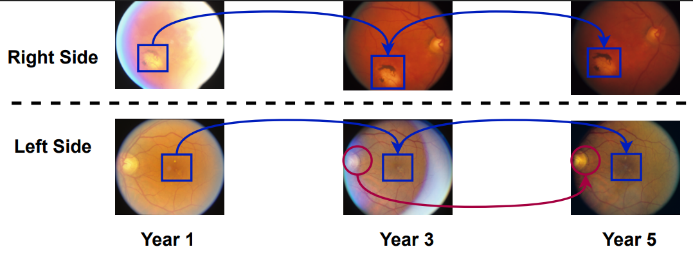
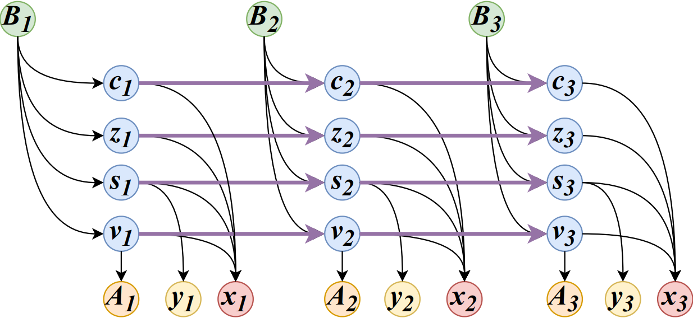
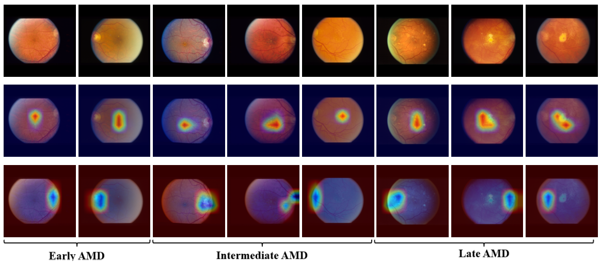
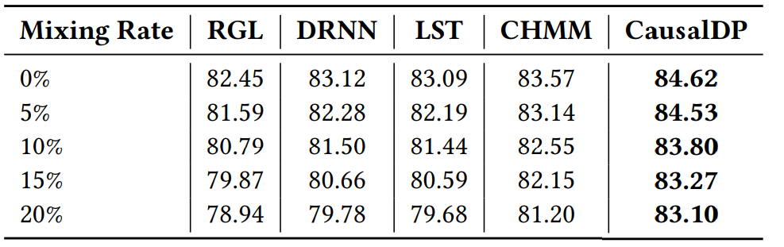
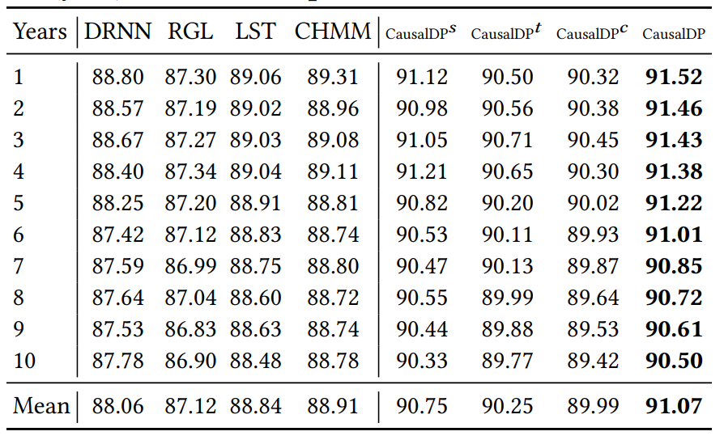
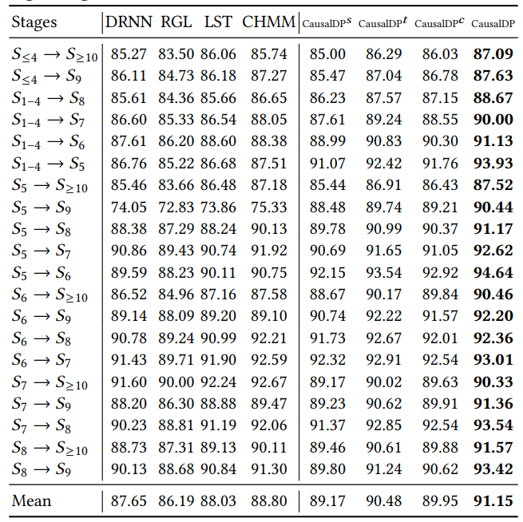
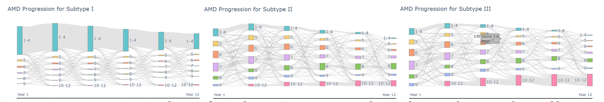

# Age-Related Macular Degeneration Progression Modeling via Temporal-Spatial Representation on Retinal Image Sequences 


This repository contains the official PyTorch implementation of the following paper:

> **Age-Related Macular Degeneration Progression Modeling via Temporal-Spatial Representation on Retinal Image Sequences**<br>
> [paper]()
>
> **Abstract:** *Age-related macular degeneration (AMD) is the leading cause of irreversible blindness in developed countries. Accurate estimation and monitoring of AMD progression are essential for enabling timely interventions and appropriate follow-up care. However, AMD patients are often elderly and present with co-existing ocular conditions (e.g., cataracts, glaucoma), leading to strong correlations among fundus abnormalities arising from different diseases. Most existing AMD-related studies directly extract abnormal features from retinal images for classification. Without explicitly separating unrelated abnormalities, the AMD progression and prediction models may inadvertently rely on spurious correlations, causing them to degenerate into general anomaly detectors and thereby increasing the misdiagnosis risk. To overcome the limitation, we propose a novel causal disease progression model, CausalDP, that disentangles multiple latent factors in fundus images, including position and background features, AMD-relevant and -unrelated abnormalities. By isolating and focusing exclusively on AMD-related abnormalities and comparing their progression, our model enhances both predictive accuracy and interpretability. Experimental results demonstrate that CausalDP effectively disentangles different image representations, accurately localizes evolving abnormal regions, and achieves improved performance in disease progression modeling. Moreover, our model provides meaningful temporal interpretability by highlighting spatial-temporal changes across image sequences, paving the way for improved personalization of AMD management. *

# AMD Disease Progression
Disease progression on retinal images. Blue squares indicate the progression of AMD-related abnormalities. Red circles show the progression of non-AMD abnormalities.



# Framework
CausalDP disentangles multiple latent factors in fundus images, including position and background features, AMD-relevant and -unrelated abnormalities.
By isolating and focusing exclusively on AMD-related abnormalities and comparing their progression, our model enhances both predictive accuracy and interpretability.


# Causal graph  
$B$, $y$, $A$, and $x$ represent the observed patient attributes (e.g., demographics), AMD stages, complications (e.g., glaucoma), and images, respectively.  
$c$, $z$, $s$, and $v$ are latent variables denoting:

- **$c$** — positional representation (e.g., left or right side)  
- **$z$** — background representation (e.g., retinal vasculature)  
- **$s$** — AMD-related abnormalities (e.g., drusen areas)  
- **$v$** — AMD-unrelated abnormalities (e.g., obscured optic disc)  



# Files Directory
    CAT-LSTM
    |
    |--code
    |
    |--file                                 * The preprocessing codes will write some files here.
    |
    |--data                                 * Put the downloaded datasets here.
    |    |--phs000001.v3.p1.c2              * Downloaded from https://dbgap.ncbi.nlm.nih.gov/aa/wga.cgi?page=request_details_pi&arid=454017&filter=arid
    |    |    
    |    |--phs000001.v1.p1.c1              * Downloaded from https://dbgap.ncbi.nlm.nih.gov/aa/wga.cgi?page=request_details_pi&arid=454018&filter=arid
    |
    |--result


# Data preprocessing
```
cd preprocessing
python low_reso.py
python generate_demo_file.py
python generate_label_file.py
```


# Train CausalDP
```
cd code
python main.py 
```


# AMD-related and -unrelated Anomaly
Each column shows a sample: top = original image, middle = AMD related weights, bottom = Non-AMD weights.


# AMD Progression Result

Accuracy of AMD stage detection.



Model performance across different prediction windows (year) on Late AMD prediction.


Performance comparison (AUROC) across different stage ranges with baselines and ablation variants.



## AMD Progression Subtyping



